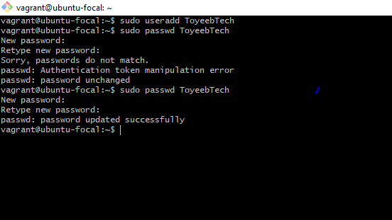
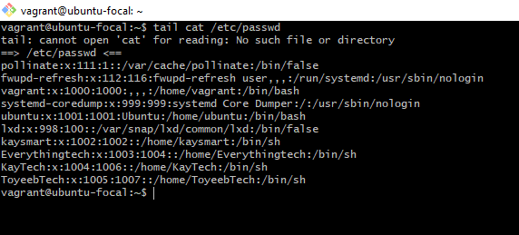

# CloudAssignment on User Management Tasks
AltSchool Cloud Assignment

## Create a User

1. I created a user named "jesse" using the `useradd` command:
   sudo useradd ToyeebTech
2. I set a password for the user "jesse" using the `passwd` command:
   sudo passwd Toyeeb
   
3. I check the new user added "tail /etc/passwd"
   
  

## Set Expiry Date for the User

1.  the expiry date of 2 weeks for the user "jesse" was created using the `chage` command:
   sudo chage -E $(date -d '+2 weeks' +%Y-%m-%d) jesse
2. To check the password history and account aging information:
   chage -l jesse
[Imgur](https://i.imgur.com/mIMvtQw.jpg)

## Prompt User to Change Password on Login

1. I Used the `chage` command to prompt user to change passwd on login
   sudo chage -d 0 -m jesse
2. To check if the user "jesse" is prompted to change their password on login:
   sudo passwd -S jesse
[Imgur](https://i.imgur.com/Q6gbGnn.jpg)

## Attach User to a Group

1. i attached the user "jesse" to a group called "altschool" using the `usermod` command:
   sudo usermod -a -G altschool jesse
2. To verify the user's group membership:
   getent group | grep altschool
[Imgur](https://i.imgur.com/PTZQvJH.jpg)

## Allow Group to Run 'cat' Command on /etc/

1. I edited the sudoers file to allow the "altschool" group to run the `cat` command on `/etc/`:
   sudo visudo
  to Add the following line:
plaintext
   %altschool ALL=(ALL:ALL) /bin/cat /etc/*
2. To verify the changes in the sudoers file:
   cat /etc/group | grep altschool
[Imgur](https://i.imgur.com/wrCndVY.jpg)

## Create Another User without a Home Directory

1. I created a user named "alenyika" without a home directory using the `useradd` command with the `-M` option:
   sudo useradd -M alenyika
2. To check the contents of the "/home" directory (to verify no home directory for "alenyika"):
   ls -al /home
[Imgur](https://i.imgur.com/R6RElm7.jpg)
