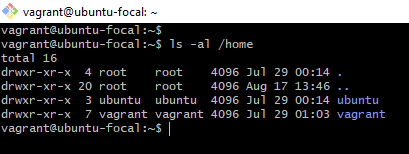

# CloudAssignment on User Management Tasks
AltSchool Cloud Assignment

## Create a User

1. I created a user named "ToyeebTech" using the `useradd` command:
   sudo useradd ToyeebTech
2. I set a password for the user "ToyeebTech" using the `passwd` command:
   sudo passwd ToyeebTech
   
3. I check the new user added "tail /etc/passwd"
   
  

## Set Expiry Date for the User

1.  the expiry date of 2 weeks for the user "ToyeebTech" was created using the `chage` command:
   sudo chage -E $(date -d '+2 weeks' +%Y-%m-%d) ToyeebTech
2. To check the password history and account aging information:
   chage -l ToyeebTech

## Prompt User to Change Password on Login

1. I Used the `chage` command to prompt user to change passwd on login
   sudo chage -d 0 ToyeebTech
2. To check if the user "ToyeebTech" is prompted to change their password on login:
   sudo chage -l ToyeebTech

## Attach User to a Group

1. I created a group "altschool" using 'groupadd' command
2. I attached the user "ToyeebTech" to a group called "altschool" using the `usermod` command:
   sudo usermod -a -G altschool ToyeebTech
4. I verify the user's group membership using:
   getent group | grep altschool

## Allow Group to Run 'cat' Command on /etc/

1. I edited the sudoers file to allow the "altschool" group to run the `cat` command on `/etc/`:
   sudo visudo
  to Add the following line:
plaintext
   %altschool ALL=(ALL:ALL) /bin/cat /etc/*
   
3. I verify the changes in the sudoers file:
   cat /etc/group | grep altschool

## Create Another User without a Home Directory

1. I created a user named "Ttech" without a home directory using the `useradd` command with the `-M` option:
   sudo useradd -M Ttech
2. To check the contents of the "/home" directory (to verify no home directory for "Ttech"):
   ls -al /home

